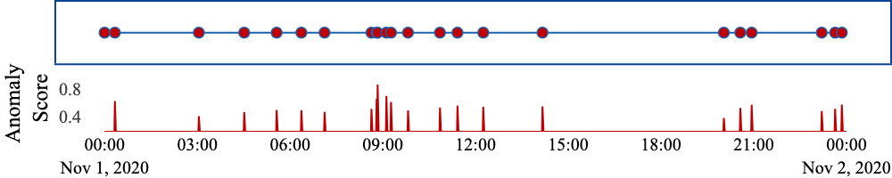
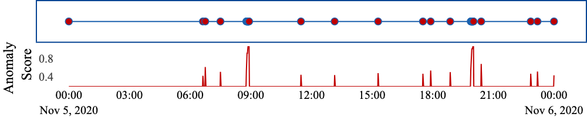

# AD2S
Official repo for "AD2S: Adaptive Anomaly Detection on Sporadic Data Streams"

## Installing dependencies

To install the defined dependencies for this project, just run the install command

```bash
# Install the poetry package manager
curl -sSL https://install.python-poetry.org | python3 -
# And then install the dependencies
poetry install
```


## Generate the synthetic dataset

Before you generate the synthetic dataset, you need to config the `root_path` of this project in the `utils/syn_config.yaml` file. You can also use the data directly from the `data` folder.

To generate the synthetic dataset, run the following command

```bash
python utils/synthetic.py --multirun data.synthetic_ds=1,2,3,4
```

This will generate the 4 different synthetic datasets defined in the paper. The generated datasets will be stored in the `data` folder.

Or, you can generate a single dataset by running the following command after setting the `data.synthetic_ds` flag to the desired dataset number.

```bash
python utils/synthetic.py
```

## Tutorial

We provide a quick tutorial on how to use the code in this repo. The tutorial is available in the `tutorial.ipynb`. You can follow the anomaly scores and parameters that you're interested in.

## Case Study

Case study can be found in `experiments/case_study.ipynb`




## Experiments

```
experiments
├── ablation
├── case_study
├── comparison
├── concept_drift
├── parameters_init_p
└── parameters_n_chains
```

All the experiments can be found in the `experiments` folder, including the ablation study, comparison with other methods, and the effect of the parameters. All the source code and results are listed in the corresponding folders.
